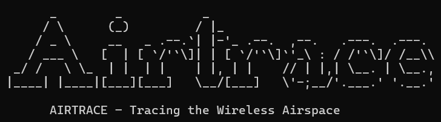
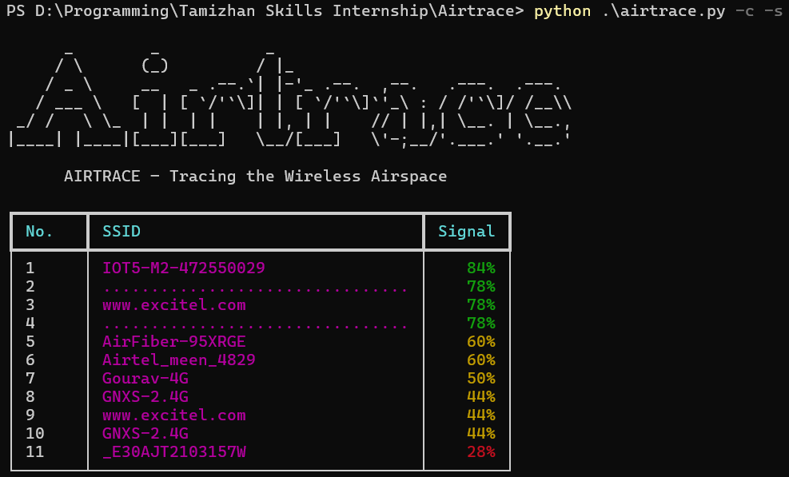

#  

**Airtrace** is a lightweight, real-time Wi-Fi signal scanner for OSINT professionals, cybersecurity researchers, and network analysts. Built with Python, it provides a powerful, cross-platform command-line interface for scanning and visualizing available Wi-Fi networks.


##  Features

-  Cross-platform (Windows, Linux, macOS)
-  Scans all available Wi-Fi networks (not just connected)
-  Sort by signal strength
-  Optional color-coded signal display
-  Continuous scanning mode with live updates
-  JSON output support
-  Built with `pywifi`, `rich`, and native tools


##  Installation

1. Clone the repository:
   ```bash
   git clone https://github.com/yourusername/airtrace.git
   cd airtrace
    ```

2. Install dependencies:

   ```bash
   pip install -r requirements.txt
   ```


##  Usage

### One-Time Scan

```bash
python airtrace.py -s -c
```

* `-s` or `--sort`: Sort networks by signal strength
* `-c` or `--color`: Enable color-coded signal display

### Real-Time Monitoring

```bash
python airtrace.py -s -c -l 5
```

* `-l` or `--loop`: Refresh every X seconds until `Ctrl+C`

### Export as JSON

```bash
python airtrace.py --json
```

## Demo (Screenshot)


##  Project Structure

```
airtrace/
├── src/
│   ├── cli.py         # CLI and argument parsing
│   ├── scanner.py     # OS-level Wi-Fi scanning
│   ├── utils.py       # Formatting and display
│   └── banner.py      # CLI branding banner
├── airtrace.py        # Entry point
├── requirements.txt   # Dependencies
├── README.md          # Project documentation
└── .gitignore         # Ignore cache/temp/build files
```


##  Dependencies

* `colorama` – for cross-platform colored output
* `pywifi` – to interact with Wi-Fi interfaces
* `comtypes` – required by `pywifi` on Windows
* `rich` – for modern terminal output and live display

Install via:

```bash
pip install -r requirements.txt
```


##  License

**MIT License** – Use, modify, and distribute freely with attribution.

